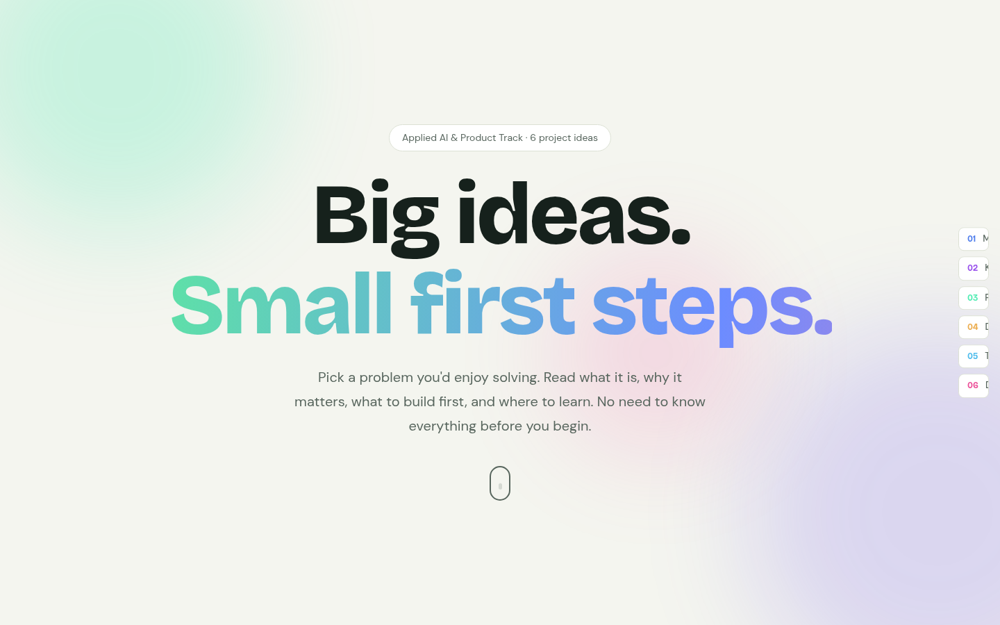
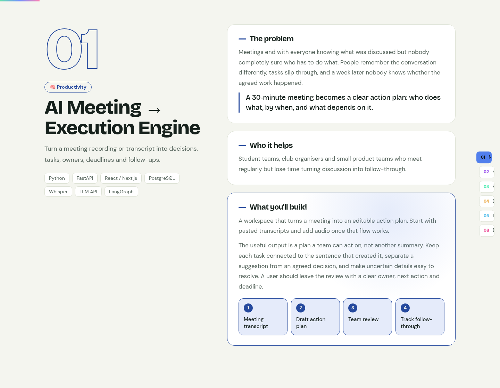
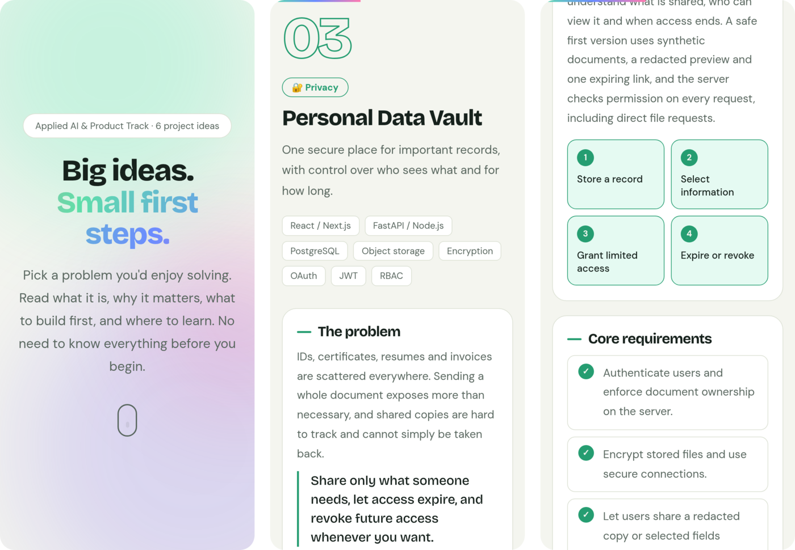

<div align="center">

<a href="https://project-ideas-ai-ml-club.vercel.app"></a>

<br>

<a href="https://project-ideas-ai-ml-club.vercel.app"></a>


**[Live site](https://project-ideas-ai-ml-club.vercel.app)** · **[The six projects](#the-six-projects)** · **[Run it locally](#run-it-locally)** · **[Add a project](#add-or-edit-a-project)**

</div>

<br>


## What this is

A one-page guide to six project ideas for the **AI/ML Club's Applied AI & Product Track**. Each idea explains the problem, who it helps, what to build, the core requirements, a small first version, a demo worth showing, how to check it works, and where to learn.

The whole site is a single HTML file. No framework, no build step, and nothing to install.

## Preview

<a href="https://project-ideas-ai-ml-club.vercel.app">
<picture>
  <source media="(prefers-color-scheme: dark)" srcset="assets/demo-dark.webp">
  
</picture>
</a>

<table>
<tr>
<td width="50%">
<picture>
  <source media="(prefers-color-scheme: dark)" srcset="assets/hero-dark.png">
  
</picture>
<p align="center"><sub>Hero</sub></p>
</td>
<td width="50%">
<picture>
  <source media="(prefers-color-scheme: dark)" srcset="assets/project-dark.png">
  
</picture>
<p align="center"><sub>A project section</sub></p>
</td>
</tr>
</table>

## The six projects

| # | Project | Area | Start here: your first version |
|:-:|---|---|---|
| 01 | 🧠 **[AI Meeting → Execution Engine](https://project-ideas-ai-ml-club.vercel.app/#p0)**<br><sub>Turn a meeting recording or transcript into decisions, tasks, owners, deadlines and follow-ups.</sub> | Productivity | Paste one transcript, review the extracted tasks, and save a simple action board. |
| 02 | 🧠 **[Personal Knowledge Decay Detector](https://project-ideas-ai-ml-club.vercel.app/#p1)**<br><sub>Notice which concepts you are forgetting, using your actual recall instead of a "studied" checkbox.</sub> | Learning | Add notes for one topic, take a short quiz, and see a revision suggestion based on the result. |
| 03 | 🔐 **[Personal Data Vault](https://project-ideas-ai-ml-club.vercel.app/#p2)**<br><sub>One secure place for important records, with control over who sees what and for how long.</sub> | Privacy | Upload a document and share a redacted version through an expiring link that can be revoked. |
| 04 | 📊 **[AI Data Cleaning Investigator](https://project-ideas-ai-ml-club.vercel.app/#p3)**<br><sub>Investigate why a dataset is broken, explain what might be wrong, and suggest fixes you can preview.</sub> | Data & ML | Upload a CSV, inspect three types of issues, preview fixes and download a cleaned copy. |
| 05 | 🧠 **[AI Second Brain for a Team](https://project-ideas-ai-ml-club.vercel.app/#p4)**<br><sub>Help teams find what they decided, why, and where the evidence lives.</sub> | Team knowledge | Index a small set of project documents and answer decision questions with clickable sources. |
| 06 | 📖 **[Collaborative Decision Journal](https://project-ideas-ai-ml-club.vercel.app/#p5)**<br><sub>Record what the team expected when it decided, then compare with what actually happened.</sub> | Team decisions | Create a decision entry, set a review date, and record the actual outcome next to the prediction. |

### Inside every project

| Section | What it covers |
|---|---|
| **The problem** | What goes wrong today, with a concrete example |
| **Who it helps** | The people you are building for |
| **What you'll build** | The product, plus a four-step flow |
| **Core requirements** | The must-haves, as a checklist |
| **Start here** | The smallest complete first version |
| **A demo worth showing** | A scenario that proves it works |
| **How to check it works** | How to test it honestly |
| **Learn along the way** | Hand-picked docs, repos, videos and courses |

<br>


One user, one real problem, one complete flow. The tools listed for each project are suggestions, so change the stack if it suits your team. The problem is what matters.

## On a phone

<picture>
  <source media="(prefers-color-scheme: dark)" srcset="assets/mobile-dark.png">
  
</picture>

## What moves on the page

- The headline comes in word by word, and "Small first steps." has a drifting gradient
- Blurred colour blobs float behind the hero, and a marquee scrolls the project names
- A progress bar across the top tracks how far you've scrolled
- Sections fade in as you reach them; flow steps pop in and requirement checkmarks tick in order
- A sticky side navigation highlights the project you're reading
- Cards light up with a spotlight that follows your cursor
- It follows your system's light or dark theme, and turns all motion off if you've enabled reduced motion

## Run it locally

Nothing to install. Open `project-ideas.html` in a browser, or serve the folder:

```bash
git clone https://github.com/kartikeyajay2006/project_ideas--AI-ML-CLUB.git
cd project_ideas--AI-ML-CLUB
python3 -m http.server 8000
# then open http://localhost:8000/project-ideas.html
```

## Deployment

The site runs on [Vercel](https://vercel.com) as a static site, with no framework and no build command:

- [`vercel.json`](vercel.json) serves `project-ideas.html` at `/`
- [`.vercelignore`](.vercelignore) uploads only the page and its config, so this README and the images in `assets/` stay out of the deployment

Deploys go out from the Vercel CLI. After pushing a change, publish it with:

```bash
npx vercel --prod
```

To deploy your own copy instead, import the repository at [vercel.com/new](https://vercel.com/new), keep the framework preset as **Other**, leave the build settings empty, and deploy.

## Add or edit a project

All the content lives in the `P` array inside the `<script>` at the bottom of `project-ideas.html`. Each project is one object:

```js
{e:'🧠', t:'Project title', cat:'Category', h:222,          // emoji, title, category tag, accent hue (0–360)
 sum:'One-line summary', ex:'A concrete example',
 prob:'The problem', who:'Who it helps',
 build:'What you will build', more:'More detail on the approach',
 flow:['Step 1','Step 2','Step 3','Step 4'],               // four steps
 req:['A core requirement', '…'],
 first:'The smallest first version', demo:'A demo scenario', check:'How to check it works',
 stack:['Python','FastAPI', '…'],
 res:[['Resource title','Short description','https://…','Docs']]}  // label: Docs, Repo, Video, Guide or Course
```

When you add a project, also add a short name for it to the `L` array, which labels the side navigation. Numbering, navigation and the marquee update on their own.

## Project structure

```
├── project-ideas.html   the whole site: HTML, CSS and JavaScript in one file
├── vercel.json          serves the page at /
├── .vercelignore        deploys only the page and its config
└── assets/              images and animations used in this README
```

<br>


<div align="center"><sub>Made for the AI/ML Club · Applied AI & Product Track</sub></div>
